# Dogs vs Cats Kaggle Challenge

    

[Kaggle](https://www.kaggle.com/c/dogs-vs-cats) introduced a challenge to determine how to distinguish images of cats v dogs.  There have been some magnificent entries and Francois Chollet uses this competition in his book "Deep Learning with Python" to introduce topics in computer vision.  

In this repo, I go through:  
* Setting up the directory strucuture  `makeTrainTest.py`
* Building a convolution neural network to solve the problem with `basic_mode.py`  
* Using data augmentation to improve the network  `basic_model_with_aug.py`
* Optimising that network  
* Transfer learning `basic_model_with_transfer_learning.py`

I also go through using TFRecords `makeTFRecords.py` to imporve the performance of the network in `basic_model_with_TFRecord.py` and some data visualisations of the network in `what_cnns_see.py`.  This covers visualising the intermediate convolutional layers given an input image, understanding what each feature map is looking for by deriving an image that maximises the ouput from this feature map and heatmaps which parts of the image are most important to the CNN.  This uses Francois Chollet's elephant example to produce the heat map and superimpose this on the original image to show what part of the image is most important in the classification

    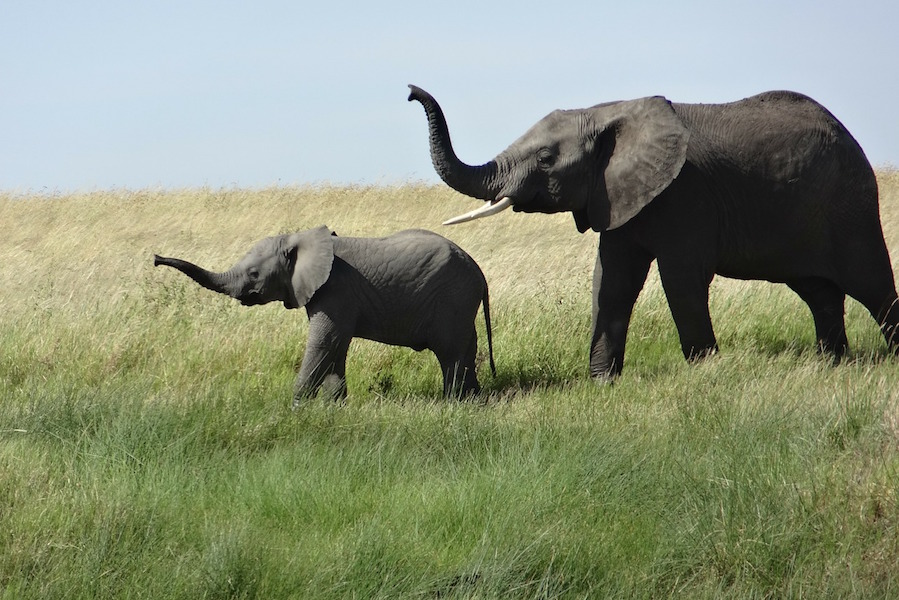
    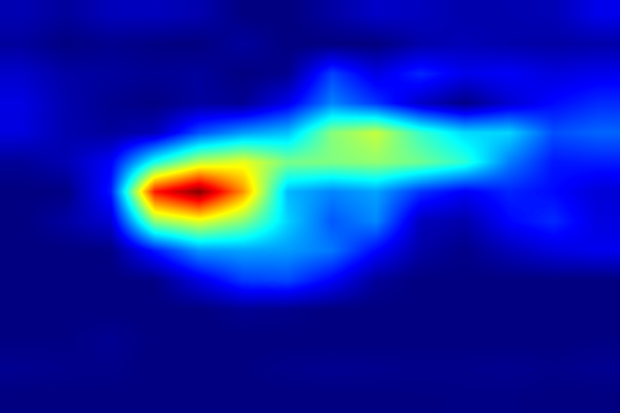
    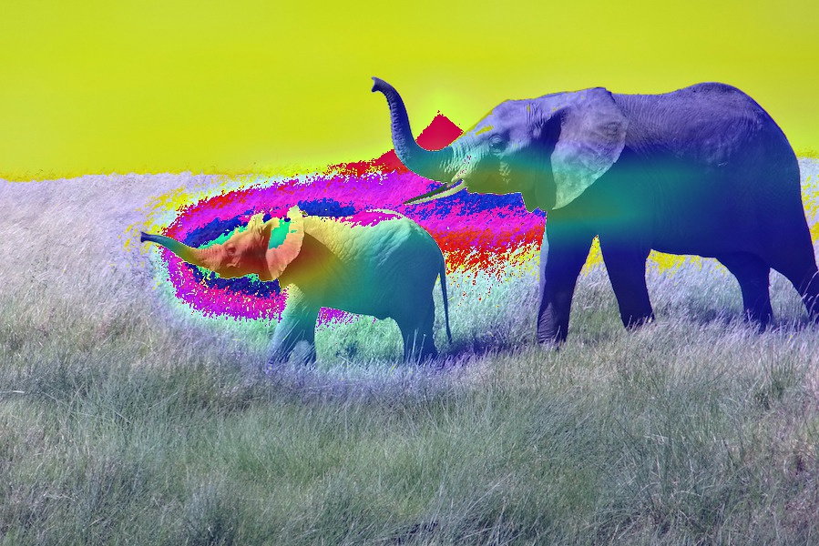

## Visualising the intermediate layers

In order to extract the feature maps we want to look at, the model that take an images as input, and outputs the activation. To do this, the model is instantiated using two arguments: an input tensor (or list of input tensors), and an output tensor (or list of output tensors). The resulting model, maps inputs to the  multiple outputs.

`what_cnns_see.py` first shows what the first layer and first filter of the VGG16 network sees when fed the image.

    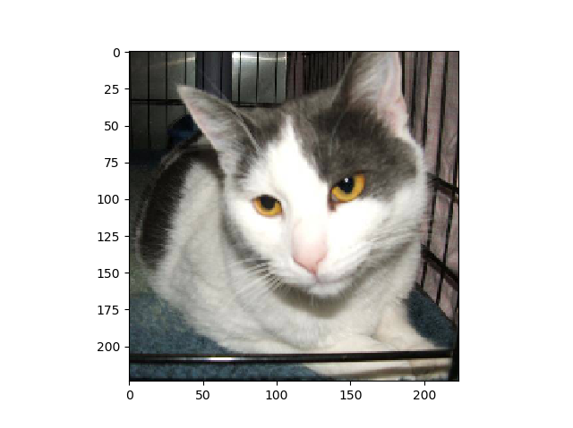
    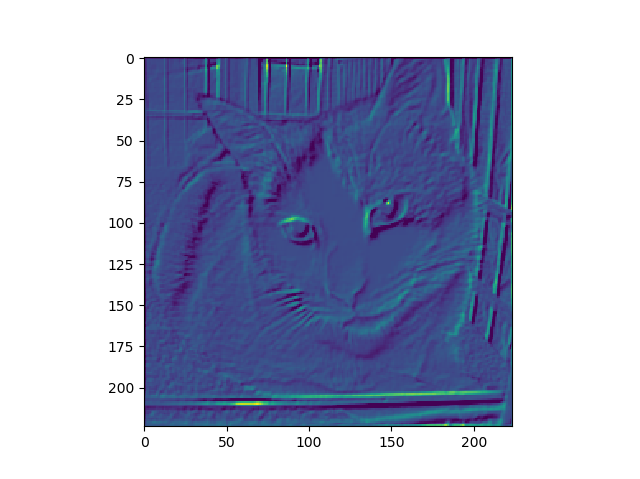

With other filters in the first convolutional layer:

    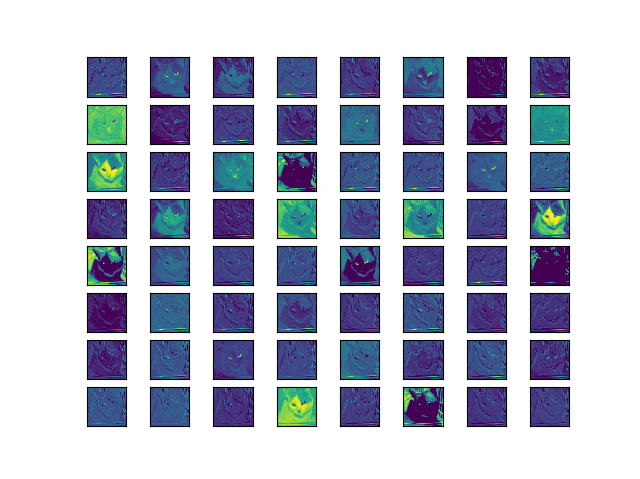

As we move through the network, the convolutional layers look for more and more abstractions of the image.

    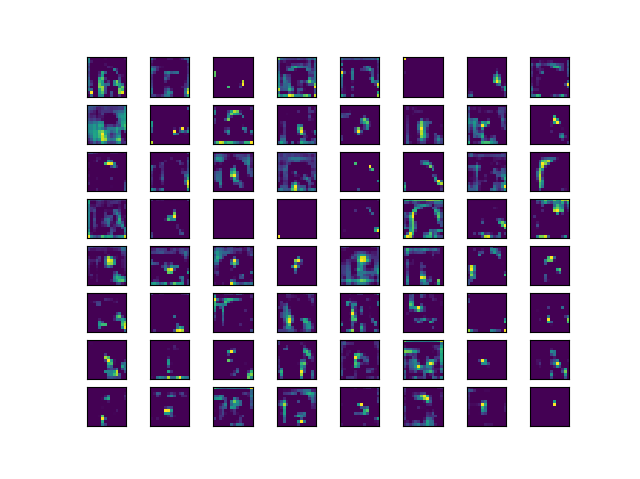

### What is the CNN looking for
This [article](https://www.sicara.ai/blog/2019-08-28-interpretability-deep-learning-tensorflow) is just a **brilliant** explanation of how to inspect CNNs.  

We can use gradient ascent in input space, to inspect the filters learned by convnets and display the visual pattern that each filter is meant to respond to.  That is we want to generate an input to the network that maximizes the reaction of a given kernel filter.

The process is simple: we will build a loss function that maximizes the value of a given filter in a given convolution layer, then we will use stochastic gradient descent to adjust the values of the input image so as to maximize this activation value.

Looking at `block5_conv1` gives:

    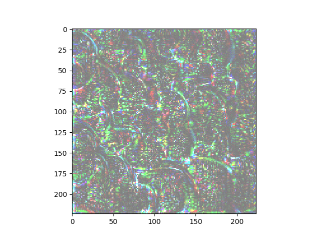
    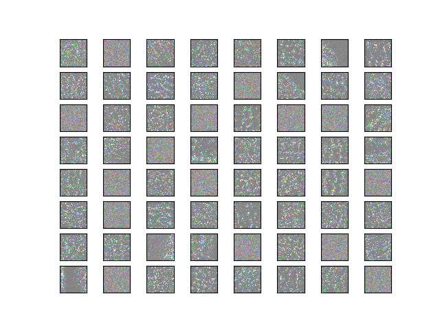

### Heatmaps
When the `what_cnns_see.py` is applied to the Dogs vs Cats data, on the early layers the following heat maps are produced.

    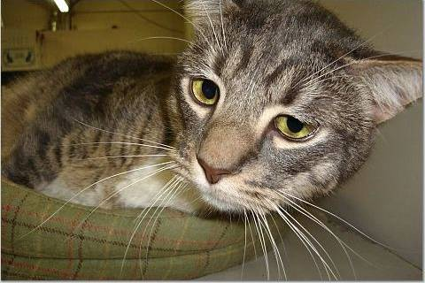
    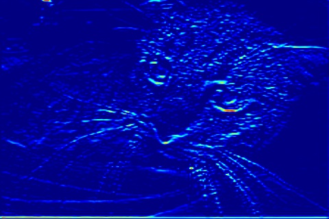
    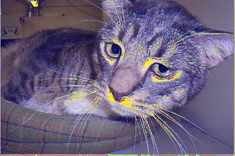
    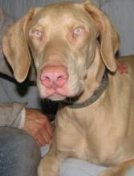
    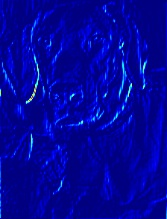
    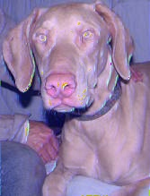 

These aren't very descriptive.  But later layers 

    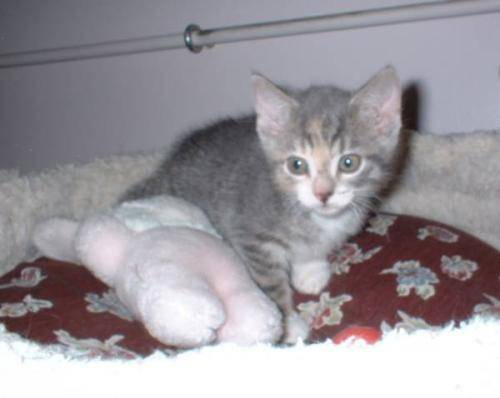
    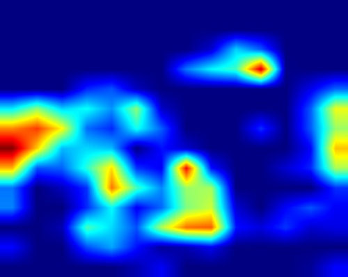
    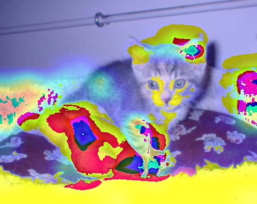
    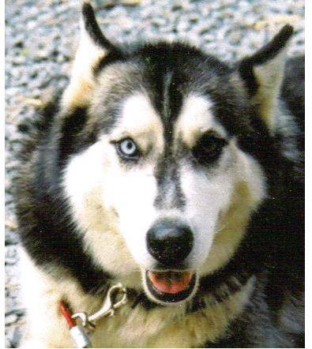
    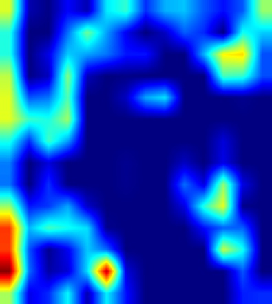
    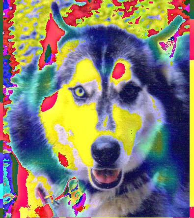 

